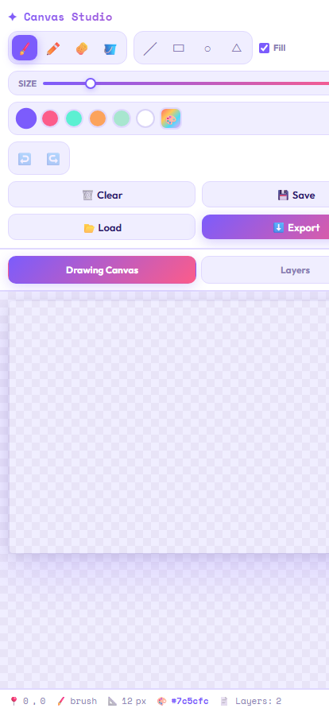

# Canvas Studio

Canvas Studio is a responsive browser-based drawing app with a layered editing
workspace, shape tools, undo/redo history, file import, JSON save/load, PNG
export, and mobile tabs for switching between the canvas and layers panel.

## Preview

## Day 1 Progress

- Created the base project structure with separate HTML, CSS, and JavaScript files.
- Built the responsive app shell with toolbar, sidebar, canvas area, and status bar.
- Added mobile tabs for switching between the drawing canvas and layers panel.
- Implemented basic brush, pencil, eraser, color, size, and clear-canvas behavior.

## Day 2 Progress

- Added a real layer stack with separate canvases for each layer.
- Added layer creation, selection, deletion, visibility toggles, and opacity control.
- Added live layer thumbnails and layer count updates in the status bar.
- Updated drawing actions so brush, pencil, eraser, and clear apply to the active layer.

## Day 3 Progress

- Added line, rectangle, circle, and triangle tools to the toolbar.
- Added live shape previews on the interactive canvas while dragging.
- Added filled and outlined shape rendering through the Fill toggle.
- Connected shape commits to the active layer so layer controls continue to work.

## Day 4 Progress

- Added undo and redo controls to the toolbar.
- Added per-layer snapshot history for drawing, shapes, and clear actions.
- Added keyboard shortcuts for Ctrl+Z and Ctrl+Y.
- Improved drawing state cleanup so previews and active-layer history stay consistent.

## Day 5 Progress

- Added the fill bucket tool with tolerance-based flood fill.
- Added PNG export with visible layers composited in order.
- Added JSON save and load for restoring layered drawings.
- Added image import into the active layer.

## Day 6 Progress

- Restored the complete color palette and original brush-size range.
- Added final toolbar polish and desktop tooltips.
- Added project preview screenshots for README.
- Completed final responsive checks for the mobile Canvas/Layers workflow.

## Features

- Brush, pencil, eraser, fill, line, rectangle, circle, and triangle tools.
- Multi-layer canvas with opacity, visibility, deletion, and thumbnails.
- Per-layer undo/redo support.
- JSON save/load, image import, and PNG export.
- Responsive mobile layout with dedicated Canvas and Layers tabs.
