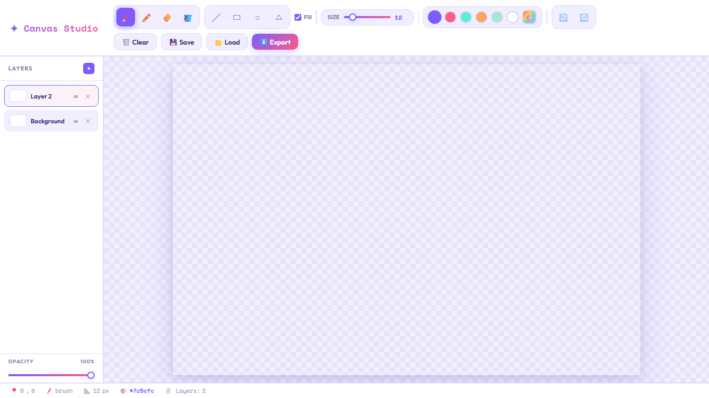

# 🎨 Canvas Studio — Layered Drawing App


A polished, responsive drawing app built with pure HTML, CSS, and Vanilla
JavaScript. Canvas Studio gives users a lightweight creative workspace with
brush tools, shape tools, layered editing, undo/redo history, file import,
JSON save/load, PNG export, and mobile Canvas/Layers tabs.

---

## 🌐 Live Demo

> https://studiocanvass.netlify.app/

---

## 📸 Preview

> 

---

## ✨ Features

- **🖌️ Drawing Tools** — Brush, pencil, eraser, and fill bucket tools
- **📐 Shape Tools** — Line, rectangle, circle, and triangle with live preview
- **🧱 Layer System** — Add, select, delete, hide, and edit separate canvas layers
- **🎚️ Layer Opacity** — Adjust opacity for the active layer
- **↩️ Undo / Redo** — Per-layer history with toolbar buttons and keyboard shortcuts
- **🎨 Color Palette** — Quick swatches plus custom color picker
- **📂 Image Import** — Load image files into the active layer
- **💾 JSON Save / Load** — Save layered projects and restore them later
- **⬇️ PNG Export** — Export visible layers as a composed PNG artwork
- **📱 Mobile Tabs** — Switch between drawing canvas and layers sidebar on small screens
- **⌨️ Keyboard Shortcuts** — Fast access to tools and history actions

---

## 🗂️ Project Structure

```text
canvas-studio/
│
├── index.html              # App layout, toolbar, sidebar, popup, and canvas shell
├── style.css               # Styles, variables, popup, responsive layout, and UI states
├── script.js               # Canvas drawing, layers, history, file handling, and app logic
└── images/
    ├── desktop-view.png    # Desktop preview screenshot
    └── mobile-view.png     # Mobile preview screenshot
```

---

## 🚀 Getting Started

No build tools or installations required.

### 1. Clone the repository

```bash
git clone https://github.com/YOUR-USERNAME/canvas-studio.git
```

### 2. Open in browser

```bash
cd canvas-studio
open index.html
```

Or simply double-click `index.html` — it runs entirely in the browser.

---

## 🎮 How to Use

| Action              | How                                                     |
| ------------------- | ------------------------------------------------------- |
| Draw freely         | Select **Brush** or **Pencil** and drag on the canvas   |
| Erase content       | Select **Eraser** and drag over artwork                 |
| Fill an area        | Select **Fill** and click a region on the active layer  |
| Draw shapes         | Choose Line, Rectangle, Circle, or Triangle and drag    |
| Toggle filled shape | Use the **Fill** checkbox near the shape tools          |
| Change brush size   | Move the **Size** slider                                |
| Change color        | Pick a swatch or use the custom color picker            |
| Add a layer         | Click the **+** button in the Layers panel              |
| Select a layer      | Click a layer item in the sidebar                       |
| Hide/show a layer   | Click the visibility icon on a layer                    |
| Delete a layer      | Click the delete icon on a layer                        |
| Adjust opacity      | Select a layer and move the opacity slider              |
| Undo / redo         | Click ↩️ / ↪️ or press `Ctrl+Z` / `Ctrl+Y`              |
| Save project        | Click **Save** to download a JSON file                  |
| Load project/image  | Click **Load** and select a `.json` or image file       |
| Export artwork      | Click **Export** to download a PNG file                 |
| Mobile navigation   | Use **Drawing Canvas** and **Layers** tabs              |
| Close info popup    | Click **Start Drawing!**, click outside, or press `Esc` |

---

## 💻 Key JavaScript Concepts

- **Canvas API** — Strokes, shape rendering, preview canvas, compositing, and PNG export
- **Layered Rendering** — Separate canvas elements stacked in one workspace
- **State Management** — Active tool, color, size, layer, opacity, visibility, and history stacks
- **DOM Manipulation** — Dynamic layer list, thumbnails, active states, popup, and status bar
- **FileReader API** — Import image files and load saved JSON drawing projects
- **Blob / Object URLs** — Download JSON project files directly from the browser
- **Touch Events** — Mobile drawing support with responsive coordinate mapping
- **Keyboard Events** — Tool shortcuts plus undo/redo and popup close behavior
- **Responsive UI Logic** — Mobile tabs controlled with `data-mobile-view`

---

## 🎨 Design Highlights

- **Creative editor layout** — Compact toolbar, sidebar layers, canvas workspace, and status bar
- **Soft visual system** — Purple/pink accents, pastel panels, rounded controls, and subtle shadows
- **Checkerboard canvas** — Transparent-workspace feel for digital drawing
- **Layer thumbnails** — Small previews generated from each canvas layer
- **Micro-interactions** — Hover states, active tool states, swatch feedback, and popup animation
- **Responsive layout** — Toolbar wraps cleanly and mobile users switch between Canvas and Layers
- **Info popup** — First-load app guide with usage, features, JS concepts, and technologies

---

## 📦 Dependencies

All loaded via CDN or browser APIs — no `npm install` needed.

| Resource                                                        | Purpose              |
| --------------------------------------------------------------- | -------------------- |
| [Google Fonts — Outfit & Space Mono](https://fonts.google.com/) | Typography           |
| Browser Canvas API                                              | Drawing and export   |
| Browser FileReader API                                          | Image/project import |
| Browser Blob API                                                | JSON downloads       |

---

## 🛠️ Possible Improvements

- [ ] Add draggable layer reordering
- [ ] Add blend modes for layers
- [ ] Add canvas zoom and pan controls
- [ ] Add keyboard shortcuts for brush size
- [ ] Add a transparent PNG export option
- [ ] Add autosave with `localStorage`
- [ ] Add downloadable sample project files

---

## 🙌 Acknowledgements

- [Google Fonts](https://fonts.google.com/) — typography
- Browser Canvas API — core drawing surface

---

> Built with ❤️ using pure HTML, CSS & JavaScript — no frameworks needed.
